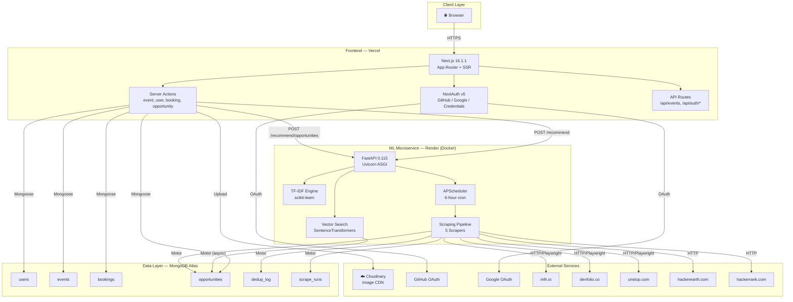
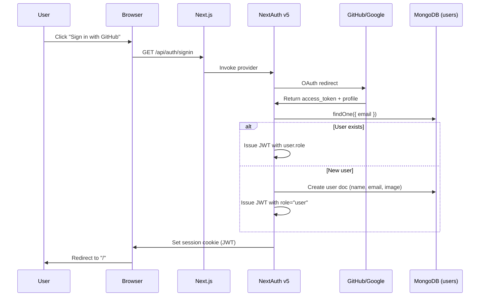
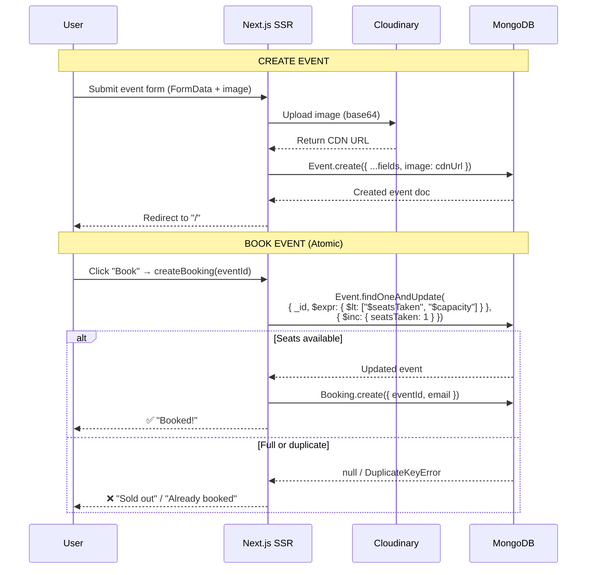
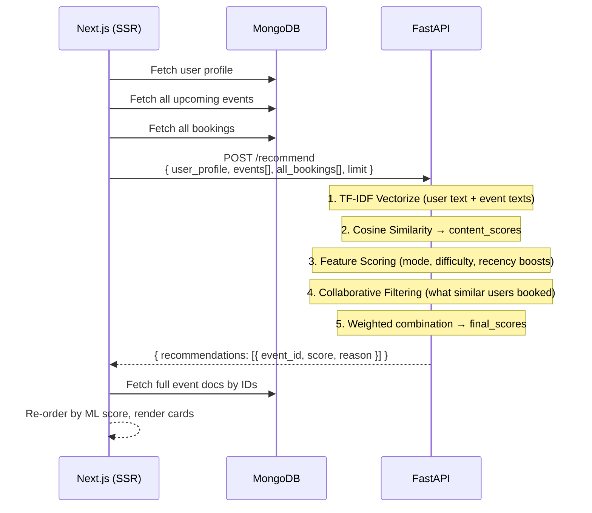
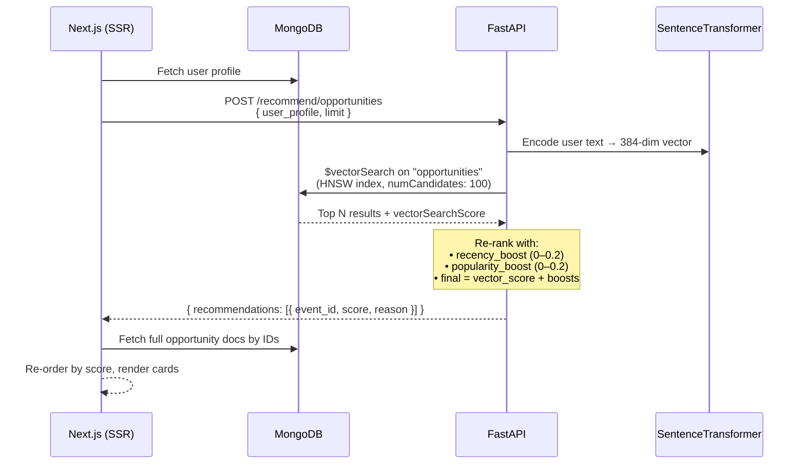
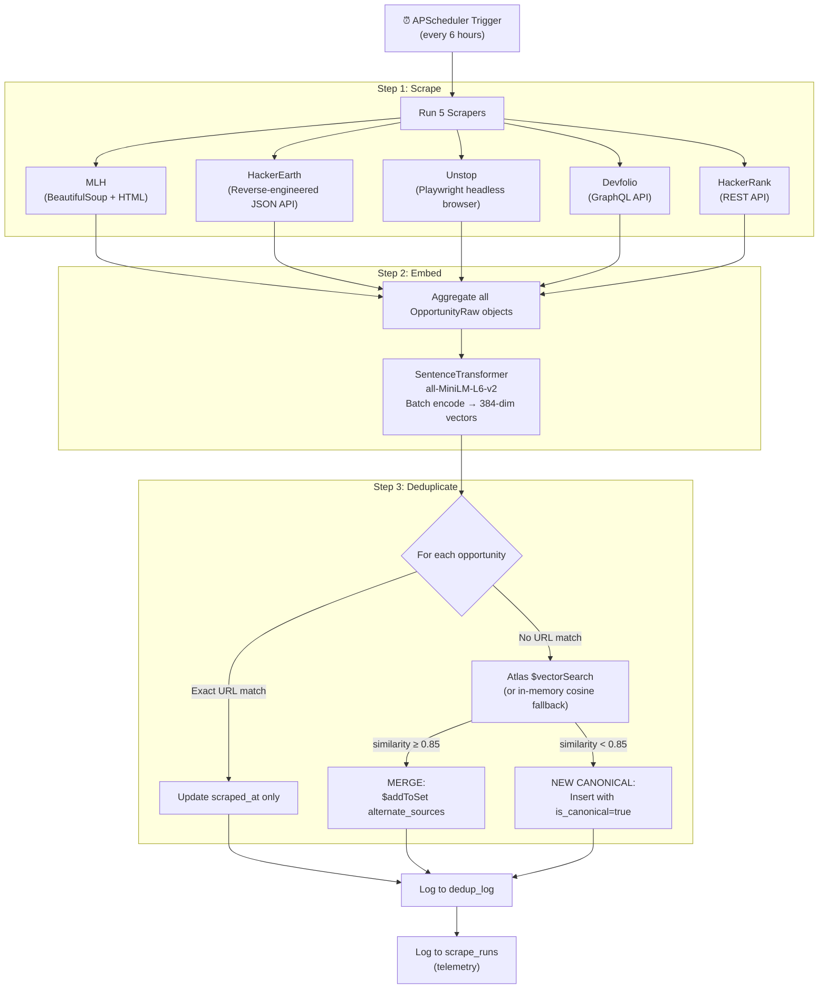
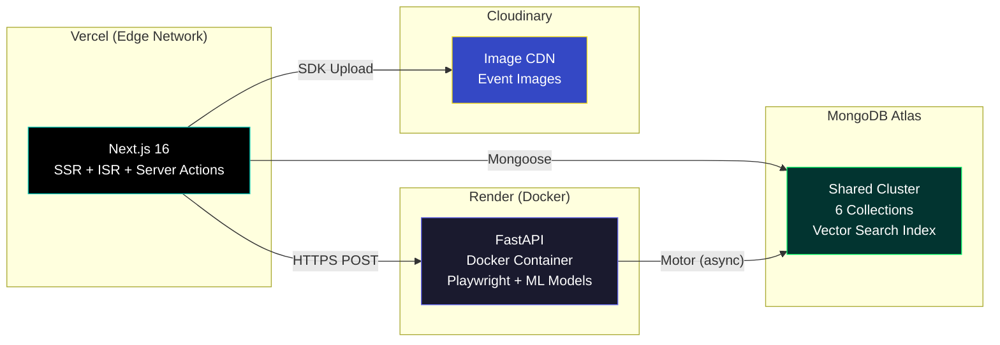

# OppLens — Complete System Design Document

> **Project:** OppLens (formerly DevEventSync)
> **Architecture:** Monorepo — Next.js 16 SSR Frontend + Python/FastAPI ML Microservice
> **Database:** MongoDB Atlas (shared between both services)
> **Deployment:** Vercel (Frontend) + Render (Microservice)

---

## 1. High-Level Architecture



---

## 2. Tech Stack

### Frontend (Next.js)

| Layer | Technology | Version | Purpose |
|-------|-----------|---------|---------|
| Framework | Next.js (App Router) | 16.1.1 | SSR, Server Actions, ISR |
| UI | React | 19.2.3 | Component Library |
| Auth | NextAuth.js v5 | 5.0.0-beta.30 | GitHub, Google, Credentials |
| ORM | Mongoose | 9.0.2 | MongoDB ODM |
| Styling | TailwindCSS | 4.x | Utility-first CSS |
| Animation | Framer Motion | 12.23.26 | Page transitions, micro-interactions |
| Icons | Lucide React | 0.562.0 | Icon library |
| Images | Cloudinary SDK | 2.8.0 | Upload + CDN |
| Analytics | PostHog | 1.310.1 | Product analytics |
| OG Images | @vercel/og | 0.8.6 | Dynamic social preview images |
| WebGL | OGL | 1.0.11 | Background effects |
| Password | bcryptjs | 3.0.3 | Credential hashing (cost 10) |
| Language | TypeScript | 5.x | Type safety |

### ML Microservice (Python)

| Layer | Technology | Version | Purpose |
|-------|-----------|---------|---------|
| Framework | FastAPI | 0.115.0 | Async REST API |
| Server | Uvicorn | 0.30.0 | ASGI production server |
| ML (Content) | scikit-learn | 1.5.2 | TF-IDF + Cosine Similarity |
| ML (Semantic) | sentence-transformers | 3.3.0 | all-MiniLM-L6-v2 (384-dim embeddings) |
| Math | NumPy | 1.26.4 | Vector operations |
| DB Driver | Motor | 3.6.0 | Async MongoDB driver |
| Validation | Pydantic | 2.9.0 | Request/response models |
| HTTP Client | httpx | 0.28.0 | Async scraping requests |
| HTML Parser | BeautifulSoup4 | 4.12.3 | DOM-based scraping |
| Browser | Playwright | 1.42.0 | JS-rendered page scraping |
| Anti-ban | fake-useragent | 2.0.3 | User-Agent rotation |
| Scheduler | APScheduler | 3.10.4 | 6-hour recurring cron |
| Container | Docker | Playwright base image | `mcr.microsoft.com/playwright/python:v1.42.0-jammy` |

---

## 3. MongoDB Collections (6 Total)

All collections live in a single database named **`opphub`**.

### 3.1 `users` — User Profiles & ML Preferences

> **Accessed by:** Next.js (Mongoose) | **Owner:** Frontend

| Field | Type | Required | Unique | Default | Notes |
|-------|------|----------|--------|---------|-------|
| `_id` | ObjectId | auto | ✅ | auto | — |
| `email` | String | ✅ | ✅ | — | Primary identifier |
| `name` | String | ✅ | — | — | — |
| `image` | String | — | — | — | Profile avatar URL |
| `interests` | [String] | — | — | `[]` | e.g. `["AI", "Web Dev"]` |
| `bio` | String | — | — | — | Free-text bio |
| `location` | String | — | — | — | — |
| `portfolio` | String | — | — | — | URL |
| `github` | String | — | — | — | URL |
| `institution` | String | — | — | — | — |
| `preferredCategories` | [String] | — | — | `[]` | ML input |
| `preferredMode` | String | — | — | `'any'` | `online/offline/hybrid/any` |
| `skillLevel` | String | — | — | `'intermediate'` | `beginner/intermediate/advanced` |
| `lastOpportunityVisit` | Date | — | — | `null` | For "New" badge count |
| `createdAt` / `updatedAt` | Date | auto | — | auto | Mongoose timestamps |

---

### 3.2 `events` — User-Created Community Events

> **Accessed by:** Next.js (Mongoose) | **Owner:** Frontend

| Field | Type | Required | Unique | Default | Notes |
|-------|------|----------|--------|---------|-------|
| `_id` | ObjectId | auto | ✅ | auto | — |
| `title` | String | ✅ | — | — | max 100 chars |
| `slug` | String | — | ✅ | — | Auto-generated from title via pre-save hook |
| `description` | String | ✅ | — | — | max 1000 chars |
| `overview` | String | ✅ | — | — | max 500 chars |
| `image` | String | ✅ | — | — | Cloudinary URL |
| `venue` | String | ✅ | — | — | — |
| `location` | String | ✅ | — | — | — |
| `date` | String | ✅ | — | — | Normalized to `YYYY-MM-DD` |
| `time` | String | ✅ | — | — | Normalized to `HH:MM` (24h) |
| `mode` | String | ✅ | — | — | `online/offline/hybrid` |
| `audience` | String | ✅ | — | — | — |
| `agenda` | [String] | ✅ | — | — | min 1 item |
| `organizer` | String | ✅ | — | — | User's email |
| `tags` | [String] | ✅ | — | — | min 1 item |
| `capacity` | Number | — | — | `50` | min: 1 |
| `seatsTaken` | Number | — | — | `0` | Atomically incremented |
| `category` | String | — | — | `'general'` | 11 enum values |
| `difficulty` | String | — | — | `'intermediate'` | `beginner/intermediate/advanced` |
| `viewCount` | Number | — | — | `0` | — |

**Indexes:** `{ date: 1, mode: 1 }` compound, `slug` unique

---

### 3.3 `bookings` — Event Registrations

> **Accessed by:** Next.js (Mongoose) | **Owner:** Frontend

| Field | Type | Required | Notes |
|-------|------|----------|-------|
| `_id` | ObjectId | auto | — |
| `eventId` | ObjectId (ref: `Event`) | ✅ | Validated on save |
| `email` | String | ✅ | RFC 5322 regex validated, lowercase |
| `createdAt` / `updatedAt` | Date | auto | Mongoose timestamps |

**Indexes:**
- `{ eventId: 1 }` — fast event lookups
- `{ email: 1 }` — fast user lookups
- `{ eventId: 1, email: 1 }` — **unique compound** (prevents double-booking)
- `{ eventId: 1, createdAt: -1 }` — chronological event bookings

---

### 3.4 `opportunities` — Scraped External Hackathons ⭐ (Bridge Collection)

> **Accessed by:** Next.js (Mongoose) **AND** Python (Motor) | **Owner:** Microservice writes, Frontend reads

| Field | Type | Required | Notes |
|-------|------|----------|-------|
| `_id` | ObjectId | auto | — |
| `title` | String | ✅ | — |
| `description` | String | ✅ | — |
| `organizer` | String | ✅ | — |
| `source_platform` | String | ✅ | `mlh/hackerearth/unstop/devfolio/hackerrank` |
| `source_url` | String | ✅ | **Unique index** |
| `alternate_sources` | [{platform, url}] | — | Populated by dedup merge |
| `category` | String | — | Default: `'hackathon'` |
| `tags` | [String] | — | Default: `[]` |
| `deadline` / `start_date` / `end_date` | Date | — | — |
| `location` | String | — | — |
| `is_remote` | Boolean | — | Default: `false` |
| `prize_info` / `eligibility` | String | — | — |
| `image_url` | String | — | Scraped or null (gradient fallback) |
| `embedding` | [Number] | — | 384-dim vector (all-MiniLM-L6-v2) |
| `popularity_score` | Number | — | Default: `0` |
| `is_canonical` | Boolean | — | Default: `true` |
| `canonical_id` | ObjectId (self-ref) | — | Points to canonical if merged |
| `viewCount` | Number | — | Default: `0` |
| `scraped_at` | Date | — | Default: `Date.now` |

**Atlas Index:** `vector_index` (HNSW) on `embedding` field

---

### 3.5 `dedup_log` — Deduplication Audit Trail (Python only)

| Field | Type | Notes |
|-------|------|-------|
| `timestamp` | datetime | Auto-set |
| `new_opp_title` | str | — |
| `new_opp_source` | str | — |
| `new_opp_url` | str | — |
| `decision` | str | `"merged"` or `"new_canonical"` |
| `canonical_id` / `canonical_title` | str \| null | If merged |
| `similarity_score` | float \| null | Cosine similarity |
| `merge_details` | str | Human-readable |

### 3.6 `scrape_runs` — Pipeline Telemetry (Python only)

| Field | Type | Notes |
|-------|------|-------|
| `timestamp` | datetime | — |
| `total_scraped` | int | Items scraped |
| `new_inserted` | int | New canonicals |
| `merged` | int | Merged duplicates |
| `duration_seconds` | float | Pipeline runtime |
| `status` | str | `"success"` or `"failed"` |

---

## 4. Collection Ownership Matrix

| Collection | Next.js Reads | Next.js Writes | Python Reads | Python Writes |
|------------|:---:|:---:|:---:|:---:|
| `users` | ✅ | ✅ | ❌ | ❌ |
| `events` | ✅ | ✅ | ❌ | ❌ |
| `bookings` | ✅ | ✅ | ❌ | ❌ |
| `opportunities` | ✅ | ❌ | ✅ | ✅ |
| `dedup_log` | ❌ | ❌ | ❌ | ✅ |
| `scrape_runs` | ❌ | ❌ | ✅ | ✅ |

---

## 5. Authentication Flow



**3 Providers:** GitHub OAuth, Google OAuth, Email+Password (bcryptjs)
**Session Strategy:** JWT (stateless, no DB sessions)
**Custom Pages:** `/login` (sign-in), `/register` (credentials only)

---

## 6. Core Data Flows

### 6.1 Event CRUD + Booking Flow



> [!IMPORTANT]
> The booking uses **MongoDB atomic operators** (`$expr` + `$inc`) in a single `findOneAndUpdate` call. This prevents race conditions where two users book the last seat simultaneously — only one will succeed.

---

### 6.2 ML Recommendation Flow (Community Events — TF-IDF)



> **Fallback:** If FastAPI is down (5s timeout via `AbortController`), Next.js falls back to `getRecommendedEvents()` — a simple regex tag-match query.

---

### 6.3 ML Recommendation Flow (Scraped Opportunities — Vector Search)



> **Key difference from TF-IDF flow:** Next.js does NOT send any events. The user profile is converted to a vector, and MongoDB's HNSW graph finds the nearest neighbors in `O(log N)` time.

---

### 6.4 Scraping Pipeline Flow (Every 6 Hours)



**Anti-Ban Protections in BaseScraper:**
- `fake_useragent` — randomizes browser fingerprint per request
- Rate limiting — 2-3 seconds between requests per source
- Exponential backoff — 2s → 4s → 8s on failure
- `httpx.AsyncClient` — 30s timeout with redirect following

---

## 7. Server Actions & API Routes Reference

### Server Actions (15 total)

| Action | File | Collections | Key Behavior |
|--------|------|-------------|-------------|
| `createEvent` | event.actions.ts | events | Cloudinary upload, slug auto-gen |
| `updateEvent` | event.actions.ts | events | Validates capacity ≥ seatsTaken |
| `deleteEvent` | event.actions.ts | events | Ownership check (organizer === email) |
| `getAllEvents` | event.actions.ts | events | Regex search + pagination |
| `getUpcomingEvents` | event.actions.ts | events | `date >= today`, sorted ASC |
| `getRecommendedEvents` | event.actions.ts | events | Tag/title regex fallback |
| `getMLRecommendedEvents` | event.actions.ts | users, events, bookings | **→ POST /recommend** |
| `getUserDashboardData` | user.actions.ts | bookings, events | "Attending" + "Hosting" tabs |
| `getUserOnboarding` | user.actions.ts | users | Upsert on login |
| `updateUser` | user.actions.ts | users | Profile + ML preferences |
| `registerUser` | user.actions.ts | users | bcrypt hash, default avatar |
| `createBooking` | booking.actions.ts | events, bookings | **Atomic $expr + $inc** |
| `deleteBooking` | booking.actions.ts | bookings, events, users | Atomic $inc: -1 |
| `getOpportunities` | opportunity.actions.ts | opportunities | Paginated, `is_canonical: true` |
| `getRecommendedOpportunities` | opportunity.actions.ts | users, opportunities | **→ POST /recommend/opportunities** |

### FastAPI Endpoints (6 total)

| Method | Path | Purpose |
|--------|------|---------|
| `GET` | `/` | Service info |
| `GET` | `/health` | Health check |
| `POST` | `/recommend` | TF-IDF + Feature + Collaborative scoring |
| `POST` | `/recommend/opportunities` | Vector Search + re-ranking |
| `POST` | `/scrape/run` | Manual pipeline trigger |
| `GET` | `/opportunities/stats` | Scraping telemetry |

---

## 8. Environment Variables

### Next.js (Vercel)

| Variable | Purpose |
|----------|---------|
| `MONGODB_URI` | Atlas connection string |
| `GITHUB_CLIENT_ID` / `SECRET` | GitHub OAuth |
| `GOOGLE_CLIENT_ID` / `SECRET` | Google OAuth |
| `AUTH_SECRET` | JWT signing key |
| `CLOUDINARY_CLOUD_NAME` | Image CDN |
| `CLOUDINARY_API_KEY` / `SECRET` | Cloudinary auth |
| `RECOMMENDATION_SERVICE_URL` | Python microservice URL |

### Python Microservice (Render)

| Variable | Default | Purpose |
|----------|---------|---------|
| `MONGODB_URI` | `mongodb://localhost:27017` | Atlas connection string |
| `MONGODB_DB_NAME` | `opphub` | Database name |
| `PORT` | `8000` | Uvicorn port |

---

## 9. Deployment Architecture



| Service | Platform | Plan | URL Pattern |
|---------|----------|------|-------------|
| Frontend | Vercel | Free/Pro | `opp-lens.vercel.app` |
| Microservice | Render | Free (512MB) | `*.onrender.com` |
| Database | MongoDB Atlas | M0 Free | `*.mongodb.net` |
| Images | Cloudinary | Free (25 credits) | `res.cloudinary.com` |

---

## 10. Key Architectural Decisions

| Decision | Why |
|----------|-----|
| **Monorepo with separate deployment** | Frontend deploys independently from ML service. A crash in Python scraping doesn't take down the website. |
| **Two recommendation algorithms** | TF-IDF works great for small, fast-changing datasets (user events). Vector Search scales to 5,000+ scraped opportunities without loading them into Python memory. |
| **Shared MongoDB, different drivers** | Mongoose (Node.js) for schema validation + hooks. Motor (Python) for async I/O during scraping. Both can read/write the `opportunities` collection safely. |
| **APScheduler over cron** | Runs inside the same Python process — no external cron service needed on Render. |
| **Atomic booking with `$expr`** | Single DB roundtrip prevents race conditions. No distributed locks needed. |
| **`is_canonical` flag for dedup** | Instead of deleting duplicates, we merge them via `alternate_sources` and keep one canonical record. This preserves cross-platform attribution. |
| **Gradient fallbacks over Unsplash** | `source.unsplash.com` API died. CSS gradients are zero-dependency and never break. |

---

## 11. Concurrency Benchmark Results

To mathematically prove the `race-condition-free` claim for the event booking pipeline, an automated stress test was conducted directly against the MongoDB Atlas database using the `motor` async driver.

**Test Methodology:**
- **Target:** A single event with `capacity: 50` and `seatsTaken: 0`.
- **Concurrency:** 200 simultaneous `findOneAndUpdate` requests dispatched using Python's `asyncio.gather()`.
- **Atomic Lock:** Each request executed `{ $expr: { $lt: ["$seatsTaken", "$capacity"] } }` and `{ $inc: { seatsTaken: 1 } }`.

**Benchmark Output:**
```text
============================================================
ATOMIC BOOKING CONCURRENCY STRESS TEST (200 USERS)
============================================================
1. Connecting to MongoDB to setup test event...
   Created test event ID: 6a64ad5748f9f44af12db354 with Capacity: 50

2. Firing 200 simultaneous booking requests directly via Motor (MongoDB)...

3. Analyzing Results...

============================================================
STRESS TEST REPORT
============================================================
Test Duration:         2.92 seconds
Total Requests Fired:  200
Successful Bookings:   50
Rejected Bookings:     150
------------------------------------------------------------
DATABASE VERIFICATION:
Expected Seats Taken:  50
Actual Seats Taken:    50
Actual Booking Docs:   50

CONCLUSION:
SUCCESS: PERFECT ACID CONSISTENCY: The atomic lock successfully
prevented 150 race condition attempts.
ZERO overbooking occurred.
```

**Conclusion:** The database-level atomic lock successfully processed 200 concurrent requests in 2.92 seconds, guaranteeing 100% data consistency and completely eliminating overbooking without the need for application-level (Node.js) distributed locks.

